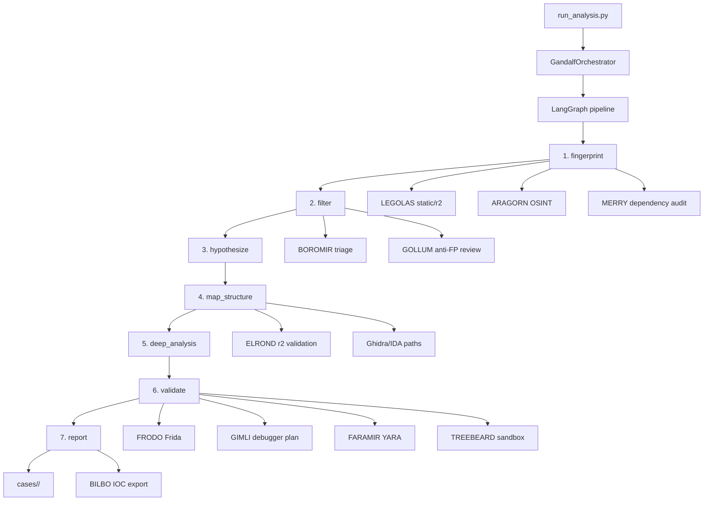

# MORDOR Architecture

## Context

MORDOR is a malware analysis orchestration runtime. It does not depend on one tool or one model. Instead, it coordinates specialized agents through a LangGraph state machine, records phase artifacts to disk, and produces an evidence-backed final report.

The project is designed for safe, repeatable reverse engineering work:

- Static analysis should happen before dynamic analysis.
- Findings should be cross-validated before they are treated as high confidence.
- Dynamic execution must happen inside TREEBEARD/Docker, not on the host.
- Every phase writes artifacts so analysis can be resumed or audited.

## High-Level Design



## Runtime Components

| Component | Path | Responsibility |
| --- | --- | --- |
| CLI entry point | `scripts/run_analysis.py` | Parses binary path, tier, and streaming flag. |
| Orchestrator | `agents/gandalf.py` | Builds initial case state and invokes the compiled graph. |
| Graph definition | `graph/pipeline.py` | Registers phase nodes and terminal edges. Routing is done by each node's `Command(goto=...)`. |
| State schema | `graph/state.py` | Defines `CaseState`, hypotheses, IoCs, and phase artifacts. |
| Phase logic | `graph/nodes.py` | Implements the seven analysis phases. |
| Artifact memory | `agents/fellowship/sam.py` | Writes and lists case artifacts. |
| Audit journal | `agents/analysis_journal.py` | Writes JSONL timing and status entries. |
| LLM client | `tools/openrouter_client.py` | OpenRouter client, structured-output fallback, circuit breaker, and Morph single-turn workaround. |
| Sandbox | `agents/fellowship/treebeard.py`, `docker-compose.yml` | Verifies Docker and injects binaries into `mordor-sandbox` without host execution. |

## Pipeline Phases

### 1. fingerprint

Collects first-pass facts from OSINT, static analysis, and dependency checks.

Primary artifacts:

- `metadata.json`
- `raw_strings.txt`
- `imports.json`
- `crypto_indicators.txt`

### 2. filter

Turns raw imports, strings, and indicators into filtered signals. BOROMIR scores signal quality and GOLLUM challenges suspicious evidence for benign explanations.

Primary artifact:

- `filtered_signals.json`

### 3. hypothesize

Builds behavioral hypotheses across persistence, command and control, injection, collection, and exfiltration categories.

Primary artifact:

- `hypotheses.md`

### 4. map_structure

Builds a component map from static analysis, cross-validation, and optional decompilation/extraction paths.

Primary artifacts:

- `component_map.json`
- `call_graph.dot`

### 5. deep_analysis

Ranks suspicious hypotheses and prepares deeper analysis. SARUMAN is reserved for higher-confidence or deep-tier paths.

Primary artifact:

- `deep_analysis_plan.md`

### 6. validate

Performs dynamic and behavioral validation using Frida, debugger planning, YARA, sandbox checks, and timeline synthesis.

Primary artifacts:

- `frida_hooks.log`
- `yara_hits.txt`
- `decoded_payloads.json`
- `behavioral_timeline.json`

### 7. report

Writes the final report and exports IOC feeds when IoCs exist.

Primary artifacts:

- `final_report.md`
- `ioc_stix2.json`
- `ioc_yara.yar`
- `ioc_sigma.yml`
- `analysis_journal_summary.json`

## State Flow

`CaseState` is initialized by `GandalfOrchestrator._build_initial_state()`:

```python
{
    "binary_path": "tests/samples/test_malware.x64",
    "sha256": "...",
    "case_dir": "cases/<sha256>",
    "analysis_tier": "standard",
    "phase_results": [],
    "hypotheses": [],
    "iocs": [],
    "artifacts": {},
}
```

Each phase appends or merges new facts into state and writes durable files under `cases/<sha256>/`.

## LLM Integration

`tools/openrouter_client.py` provides:

- `chat()` for plain chat completion.
- `chat_json()` for JSON parsing.
- `chat_structured()` for Pydantic schemas.
- `reset_circuit_breaker()` for tests and model changes.

Structured output uses a three-tier fallback:

1. `function_calling`
2. `json_schema`
3. plain chat with JSON extraction and Pydantic validation

Provider-level failures such as `404`, `400`, unsupported tool use, and multi-turn restrictions trip a process-local circuit breaker so later agents skip known-broken methods.

Morph-specific note:

- Some Morph-routed models reject requests with more than one message in the `messages` array.
- `_collapse_messages()` collapses `[system, user]` into one `[user]` message for model names containing `morph`, `moonshot`, or `kimi`.

## Routing Decision

Nodes return `langgraph.types.Command(update=..., goto=...)`. `graph/pipeline.py` intentionally does not duplicate those transitions with normal graph edges. Duplicating edges can double-schedule target nodes in LangGraph 0.6.x and create concurrent state-update errors.

Terminal edges are still declared:

```python
builder.add_edge("report", END)
builder.add_edge("error", END)
```

## Optional Coding-Agent Integrations

MORDOR has two optional coding-agent adapters, both gated behind env vars and defaulting to disabled:

### OpenCode Adapter (`tools/opencode_adapter.py`)

- Communicates with a running [OpenCode](https://opencode.ai) server via its HTTP REST API.
- Gate: `OPENCODE_ENABLED=true` in `.env`.
- Server discovered at `OPENCODE_URL` (default `http://127.0.0.1:4096`).
- Provides `coding_query()` and `run_opencode_analysis()` — both fall back to the standard LLM pipeline if the server is unreachable.

### Claude Agent Adapter (`tools/claude_agent_adapter.py`)

- Wraps the `anthropic-agent-sdk` Python package for autonomous coding queries.
- Gate: `CLAUDE_AGENT_ENABLED=true` in `.env`.
- SDK install: `pip install anthropic-agent-sdk` (Python >=3.10).
- Provides `coding_query()` and `run_agent_analysis()` — both fall back to the standard LLM pipeline if the SDK is not installed or not enabled.

### Common pattern

Both adapters expose the same `coding_query(task, context, ...)` signature, making them swappable. The fallback chain is:

1. Gate check (env var)
2. SDK/Server availability check
3. Native adapter call
4. LLM fallback via `chat()` / `chat_structured()`

## Safety Boundaries

MORDOR separates host analysis from dynamic execution:

- Static analysis can read samples from the host filesystem.
- Runtime execution must happen through `mordor-sandbox`.
- TREEBEARD uses `docker cp` to inject the sample into the container and strips sensitive API keys from the runtime environment.
- `cases/` is persistent analysis memory and should not be deleted without explicit approval.

## Key Trade-Offs

| Decision | Benefit | Cost |
| --- | --- | --- |
| LangGraph state machine | Repeatable phase order and resumable state | Requires careful channel/routing discipline |
| Agent-per-role model | Clear separation of expertise | More interfaces to maintain |
| Tool-first with LLM fallback | Works in degraded local environments | LLM output must be confidence-gated |
| Case artifacts on disk | Auditability and restartability | Requires cleanup policy for sensitive samples |
| Structured-output fallback tiers | Robust across OpenRouter providers | Some providers still emit warnings or long outputs |
